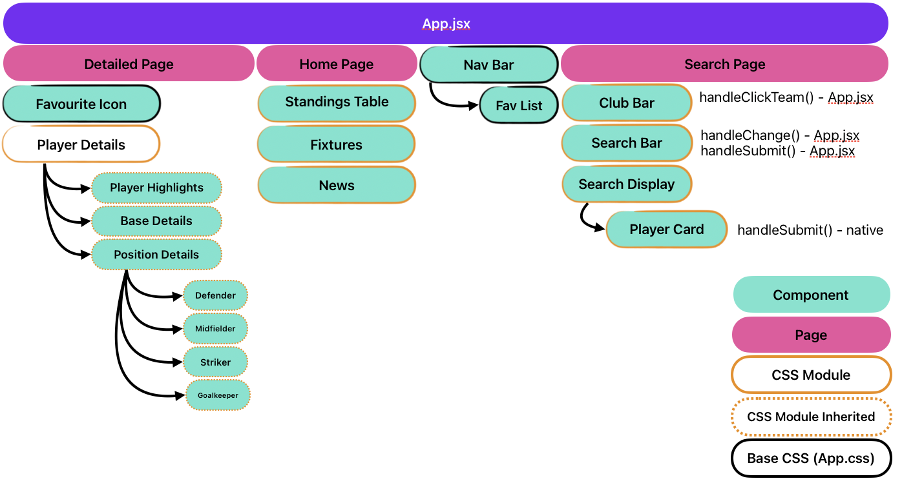

# OLE: Your one stop website for all soccer related news!

## User Stories

As a user, I want to be able to...

Core Functionalities:

- [x] navigate easily through the site through the use of a navigation bar
- [x] get a clean clear view of the current standings of the EPL (see each team's current rank and some ket information like points & goal differences)
- [x] get the outcomes of recent matches
- [ ] display additional details of the recent matches (e.g. scorers/card issued/match datetime)
- [x] see some of the latest soccer news
- [x] search for my favourite player(s) by their name
- [x] search for my favourite player(s) by team
- [x] display the corresponding search results
- [x] see detailed information of a player
- [x] "favourite" a specific player and save it in a favourite bar

Nice-to-have functionalities

- [ ] a pop-up/notification that alerts me when a player has been added to/removed from the favourites list
- [x] know what objects/elements I am about the select with hover effects
- [ ] display search history

## Technologies used

- React JS
- Base CSS

## React Architecture

